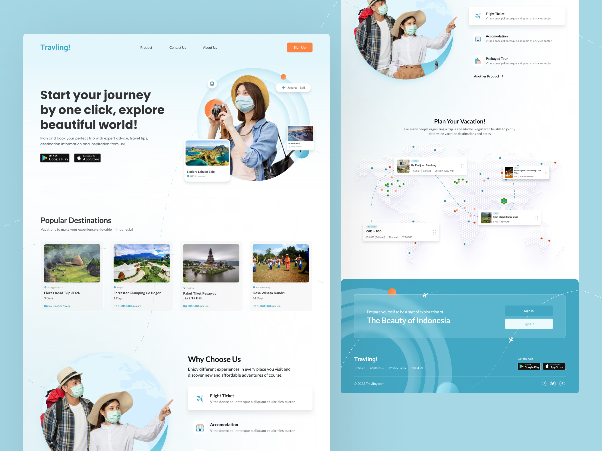

<h1 align="center"> Travelling </h1>

Landing page de um site de viagens mostrando as belezas do país e promovendo a empresa 

  <a href="#-tecnologias">Tecnologias</a>&nbsp;&nbsp;&nbsp;|&nbsp;&nbsp;&nbsp;
  <a href="#-projeto">Projeto</a>&nbsp;&nbsp;&nbsp;&nbsp;&nbsp;&nbsp;

  

 

  

## 🚀 Tecnologias

Esse projeto foi desenvolvido com as seguintes tecnologias:

- NEXT 14
- Typescript
- Tailwind CSS
- Figma
- Muito café

## 💻 Projeto

Este projeto é uma landing page **moderna** e **responsiva** para um site de viagens, desenvolvida com Next.js e Tailwind CSS. A página oferece uma experiência visualmente **atraente** com seções destacadas para destinos populares, benefícios dos serviços e um chamado à ação para planejar suas férias. Elementos interativos, **animações suaves** e ícones sociais completam o design, proporcionando uma navegação intuitiva e envolvente para os usuários.

- [Visite o projeto online](https://travelling-ivory.vercel.app/)

## :memo: Licença

Esse projeto está sob a licença MIT.

---

Feito com por Pedro Henrique, [veja meu portfólio](https://pedrofolio.vercel.app/)